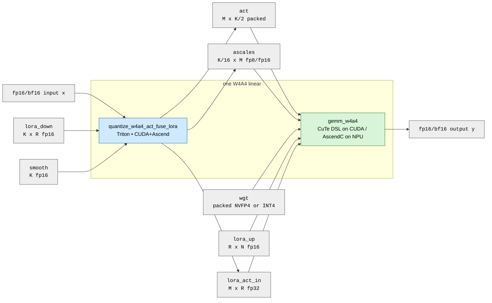
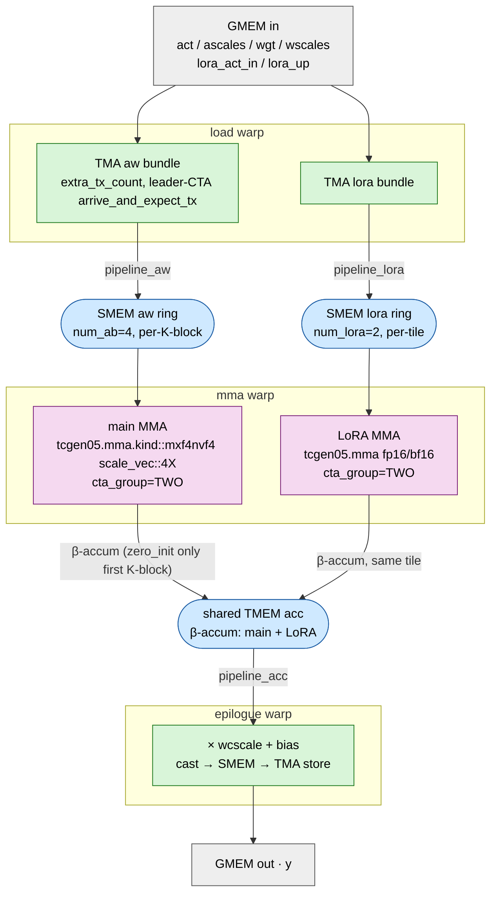

# svdquant-kernels

SVDQuant (W4A4 + low-rank correction) kernels **for vLLM**. The goal
is to back vLLM's diffusion path with 4-bit kernels on both NVIDIA
Blackwell (SM_100/103, **NVFP4**) and Huawei Ascend NPUs (**INT4**)
from a single source tree. Each backend uses the 4-bit format its
tensor unit actually supports.

**This is a kernel development workbench**, not yet a library. There
is no Python dispatcher and no framework integration yet — each kernel
is built, tested, and profiled in isolation. vLLM bindings land after
the kernels stabilize; fusions that would require vLLM pipeline
changes (e.g., folding a preceding GLU into a quantize op) are
explicitly out of scope so the kernels stay drop-in.

## Current performance

### CUDA — `gemm_w4a4` on Blackwell B200 (NVFP4, 10 PFLOPS peak)

`cute_kernels.gemm_w4a4.kernel_v2_fa4` (FA4-derived 3-warp persistent
mainloop, 2-CTA, LoRA β-interleaved into the main K-loop) vs the
nunchaku NVFP4 reference (RTX PRO 6000 Blackwell, SM_120a, 4 PFLOPS
peak, hand-written inline PTX). MFU as a fraction of each card's
dense-NVFP4 peak. Production shapes from `GEMM_SHAPES`.

| Shape (M, K, N, R)              | ours fp16 | nunchaku fp16 | ours bf16 | nunchaku bf16 |
| ------------------------------- | --------: | ------------: | --------: | ------------: |
| 4352 × 3840  × 3072  × R=128    |  **16.9** |          16.2 |      17.3 |          17.7 |
| 4352 × 3840  × 15360 × R=128    |  **26.5** |          19.5 |  **26.7** |          24.7 |
| 4352 × 15360 × 3840  × R=128    |  **27.3** |          25.0 |      27.3 |          30.5 |
| 4352 × 10240 × 3072  × R=32     |  **26.4** |          21.4 |  **26.2** |          25.2 |

**fp16: 4/4 shapes ahead. bf16: 2/4 ahead, 1/4 within ±0.5 pp noise,
1/4 still 3.2 pp behind** on the K=15360 shape. That −3.2 pp gap
tracks to the structural CuTe-DSL-MLIR-vs-hand-PTX bf16 asymmetry
called out in `docs/gpu.md § Perf-comparison context`; not a
LoRA-side issue.

**This is not an apples-to-apples comparison and not a code-quality
verdict.** nunchaku's NVFP4 is hand-rolled inline PTX
(`mma_earlycuda.cuh`) and is gated on `__CUDA_ARCH__ >= 1200` —
SM_120a/121a (consumer/workstation Blackwell). There is no SM_100
binary, so we can't run it on B200 at all. The table is therefore
*cross-chip*: ours on B200 (data-center Blackwell, 10 PFLOPS dense
NVFP4 peak) vs nunchaku on RTX PRO 6000 (4 PFLOPS peak), with the
tensor-core ISA and toolchain differing on both sides. MFU
normalizes for each card's peak, but the comparison is an
*implementation-quality reference* ("what does a mature hand-PTX
W4A4 NVFP4 kernel achieve on its target chip"), **not** a measure
of whose code is "better written".

Honest local ceiling (same B200, same shapes, no LoRA / no
epilogue / no next-quant — bare main NVFP4 MMA) from CUTLASS's
`dense_blockscaled_gemm_persistent.py`:

| Shape (M, K, N)         | CUTLASS 2-CTA 256×256 | ours 2-CTA v2_fa4 (fp16) |
| ----------------------- | --------------------: | -----------------------: |
| 4352 × 3840  × 3072     |   45.4 %              |   16.9 %                 |
| 4352 × 3840  × 15360    |   58.4 %              |   26.5 %                 |
| 4352 × 15360 × 3840     |   63.4 %              |   27.3 %                 |
| 4352 × 10240 × 3072     |   60.7 %              |   26.4 %                 |

CUTLASS doesn't carry LoRA / wcscales / bias, so the gap isn't
apples-to-apples; it's the real "no-LoRA NVFP4 ceiling" on this
chip. Closing it is task #60 territory (overlap LoRA MMA with main
K-loop epilogue tail) and main-K-loop / TMEM occupancy work, **not**
LoRA prolog depth — see `docs/gpu.md § Stage sweep` for why.

Full numbers: `cute_kernels/gemm_w4a4/README.md`,
`docs/gpu.md § MFU vs nunchaku`.

### Ascend — `gemm_w4a4` on 910B (INT4 cube + fp16 LoRA)

Phase 3a (INT4 main path, LoRA = 0) **passes**: 910B e2e via
GitCode Space, M=64 K=128 N=128 vs PyTorch `ref_int4`
**max_abs = 0.0010** (2026-05-11).

Phase 3b (LoRA-up residual) **code complete, NaN debug**: kernel
links, launches, syncs on 910B; output is fp16 with the correct
shape but `diff vs ref = NaN`. Phase 3a numerics confirm cube +
vec path; suspicion falls on `TileMatLUT` layout (ND2NZ vs
DN2ZN) or `lora_buf` UB collision. Task #95 owns the ladder
(`csrc/kernels/gemm_w4a4/ascend/PLAN.md § Phase 3b`).

No 910B perf number yet — fix correctness first, profile after.

## Algorithm — one W4A4 → W4A4 linear



Math inside `gemm_w4a4`:

```
y_fp  = scaled_mma_nvfp4(act, wgt, ascales, wscales) · wcscale + bias    # main K-loop
y_fp += lora_act_in @ lora_up                                            # β-interleaved
y    = cast(y_fp, out_dtype)
```

The main NVFP4 / INT4 MMA and the LoRA fp16 MMA target the **same**
TMEM accumulator (CUDA) / L0C tile (Ascend). On CUDA this is what the
FA4-derived warp specialization buys us: one `mma` warp issues two
MMA atoms into a shared acc, no chained S→P dependency. On Ascend the
two passes are serialized through L0C with the LoRA pass written into
a 6-slot L2-resident ring buffer the vec core then consumes.

Format split is hardware-determined, not a user knob:

| backend                     | values                | block scales       | MMA              |
| --------------------------- | --------------------- | ------------------ | ---------------- |
| CUDA SM_100 / SM_103        | NVFP4 (E2M1, 4 b)     | FP8-E4M3 per-16 K  | `tcgen05.mma.kind::mxf4nvf4.block_scale.scale_vec::4X` |
| Ascend 910B (A2/A3 cube)    | signed INT4           | FP16 per-64 K      | raw `mad_s4`     |

Blackwell `tcgen05` dropped scaled INT4 MMA; Ascend cube has no FP4
support. Each side uses what its tensor unit actually speaks.

## `gemm_w4a4` v2_fa4 — 3-warp design (CUDA, shipping)

`cute_kernels/gemm_w4a4/kernel_v2_fa4.py`. FA4-derived warp-specialized
persistent mainloop; one `load` warp drives all TMAs, one `mma` warp
issues both the main NVFP4 MMA and the LoRA fp16/bf16 MMA into the
**same** TMEM accumulator, one `epilogue` warp does `× wcscale + bias`
and the cast-and-store.



### Features

| # | Feature                                           | Where               | What it buys |
|---|---------------------------------------------------|---------------------|--------------|
| 1 | 2-CTA dense MMA (`cta_group=TWO`)                 | mma warp / cluster  | doubles per-tile FLOPs; A and B tiles halve per-CTA via `partition_shape_{A,B}` |
| 2 | NVFP4 scaled MMA (`mxf4nvf4 scale_vec::4X`)       | main MMA            | what Blackwell tensor cores actually speak — 4-bit E2M1 values + FP8-E4M3 per-16-K block scales |
| 3 | β-interleaved LoRA into **shared** TMEM acc       | mma warp            | LoRA fp16 MMA targets the same TMEM region as main NVFP4 MMA; no chained S→P dependency, no second acc dtype |
| 4 | FA4 explicit per-warp `PipelineStateSimple`       | all 3 warps         | persistent iter doesn't deadlock at >20 tiles/CTA (the 500× hang of implicit `PipelineState`, commit `61905df`) |
| 5 | `pipeline_aw` 3–4 stages, per-K-block             | load → mma          | overlaps next-K-block TMA with current MMA; `extra_tx_count` packs 4 TMAs into one barrier |
| 6 | `pipeline_lora` 2 stages, per-tile (C1)           | load → mma          | amortizes LoRA prolog across main K-loop iters; +8 pp MFU on the R=128 production shape |
| 7 | `StaticPersistentTileScheduler`                   | all warps           | grid clamped to `sm_count`; no per-tile launch overhead, `tile_idx += grid_dim()` advance |
| 8 | Multicast cluster TMA (A/B only)                  | load warp           | A/B bytes shared across both CTAs in the cluster; LA/LU stay per-CTA after stage sweep showed multicast didn't pay |
| 9 | LU SMEM **÷ cta_group_size** accounting fix       | budget solver       | the handwritten `lora_smem_bytes` over-counted LU 2× under 2-CTA; fix unlocks `num_ab=4` at `num_lora_stage=2`, +198 % TF on R=128 production |
| 10| `× wcscale + bias` fused epilogue (v2)            | epilogue warp       | per-col affine inside the kernel; no second pass for channel-wise correction |

Full prose and bring-up history: `cute_kernels/gemm_w4a4/README.md`.
Hardware traps that bit us: `docs/gotchas/cute_dsl.md`.

## Layout

```
csrc/
  common/                  headers shared across backends (dtype, TensorRef, macros)
  kernels/                 native pods — currently AscendC only
    gemm_w4a4/
      include/gemm_w4a4.h  public header (backend-agnostic signature)
      ascend/              host launcher + ccec __aicore__ device code
      PLAN.md              Ascend bring-up plan, Phase 1 → 3c
      README.md
cute_kernels/              CuTe DSL pods — Python @cute.jit, JIT-compiled at first call
  gemm_w4a4/
    kernel_v2_fa4.py       FA4-derived 3-warp persistent mainloop (shipping)
    kernel_v0_fa4.py       no-LoRA reference (frozen)
    kernel.py              monolithic v0, kept for trace cross-checks
    README.md
triton_kernels/            Triton pods — one source, runs on CUDA + Ascend
  quantize_w4a4_act_fuse_lora/
    kernel.py              @triton.jit + torch-tensor host wrapper
    README.md
baseline/                  PyTorch reference implementations (numerical ground truth)
tests/                     per-op numerical correctness tests
docs/                      architecture.md, gpu.md, npu.md, gotchas/, kernels/
cmake/                     FindCANN.cmake, cuda_arch.cmake
scripts/                   build.sh (Ascend), env_ascend.sh, modal_app.py (B200), ship.sh (Space)
pto-isa/                   vendored PTO ISA headers (Ascend cube/vec primitives)
space/                     GitCode Space deploy bundle (link_smoke.sh, app.py)
```

## The two ops

A W4A4 → W4A4 linear chain is two kernels, mirroring nunchaku's public
C++ API:

| Pod                                                                                | Location                | Library                          | Role |
| ---------------------------------------------------------------------------------- | ----------------------- | -------------------------------- | ---- |
| [`gemm_w4a4`](cute_kernels/gemm_w4a4/) (CUDA) / [Ascend](csrc/kernels/gemm_w4a4/)  | `cute_kernels/` + `csrc/kernels/` | CuTe DSL (CUDA) / AscendC (NPU) | Main W4A4 scaled-MMA + LoRA-up residual + bias |
| [`quantize_w4a4_act_fuse_lora`](triton_kernels/quantize_w4a4_act_fuse_lora/)       | `triton_kernels/`       | Triton                           | Memory-bound preprocessing: NVFP4 (or INT4) quantize of input + `x @ lora_down` small GEMM |

Library choice: compute-bound ops that need `tcgen05` / TMEM / 2-CTA
go native per backend; memory-bound ops that need to run on both CUDA
and Ascend go through Triton (one `.py` source, two hardware targets).

Weight packing (FP → INT4/NVFP4 + block scales) is offline and lives
as a pure-Python utility in `baseline/` — no kernel pod.

## Build

```
# Ascend (cross-compile aarch64 .o for 910B; CMake covers AscendC pods + tests/bench)
source scripts/env_ascend.sh
./scripts/build.sh                  # both backends; CUDA branch is a placeholder
CUDA=OFF ASCEND=ON ./scripts/build.sh
```

The `CUDA=ON` CMake branch is reserved for any future native-C++ CUDA
pod. All current CUDA work lives in `cute_kernels/` and JITs at first
call through `cutlass-dsl` — there is **no** CUDA build step. Triton
pods likewise JIT on demand. Pick a backend directly at call sites:

```python
from cute_kernels.gemm_w4a4.kernel_v2_fa4 import launch_v2          # CUDA
from triton_kernels.quantize_w4a4_act_fuse_lora.kernel import launch # CUDA + Ascend
```

```cpp
#include "kernels/gemm_w4a4/include/gemm_w4a4.h"
svdquant::ascend::gemm_w4a4(params, stream);                         // Ascend
```

See [`docs/architecture.md`](docs/architecture.md),
[`docs/gpu.md`](docs/gpu.md), and [`docs/npu.md`](docs/npu.md) for
per-backend details, and [`docs/gotchas/`](docs/gotchas/) for the
hardware traps that bit us along the way.

## Status

- **Triton `quantize_w4a4_act_fuse_lora`** — shipping, passes
  `tmp/smoke_fused.py`.
- **CUDA `gemm_w4a4`** (`cute_kernels/gemm_w4a4/kernel_v2_fa4.py`) —
  shipping on B200. fp16 ahead of nunchaku on 4/4 production shapes,
  bf16 on 3/4. Remaining work targets the gap to CUTLASS NVFP4 dense
  (no-LoRA) ceiling, not LoRA depth — see `docs/gpu.md § Stage sweep`.
- **Ascend `gemm_w4a4`** (`csrc/kernels/gemm_w4a4/ascend/`) — Phase
  3a (INT4 main path) passes 910B e2e; Phase 3b (LoRA-up residual)
  output is NaN, debug ladder in `csrc/kernels/gemm_w4a4/ascend/PLAN.md`.

## License

Apache-2.0
