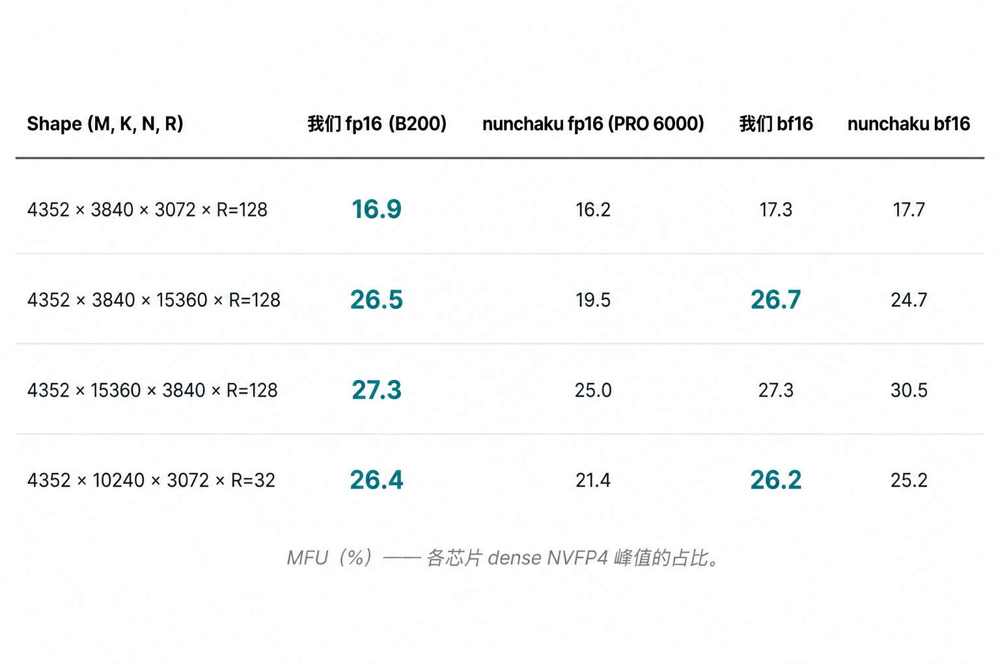
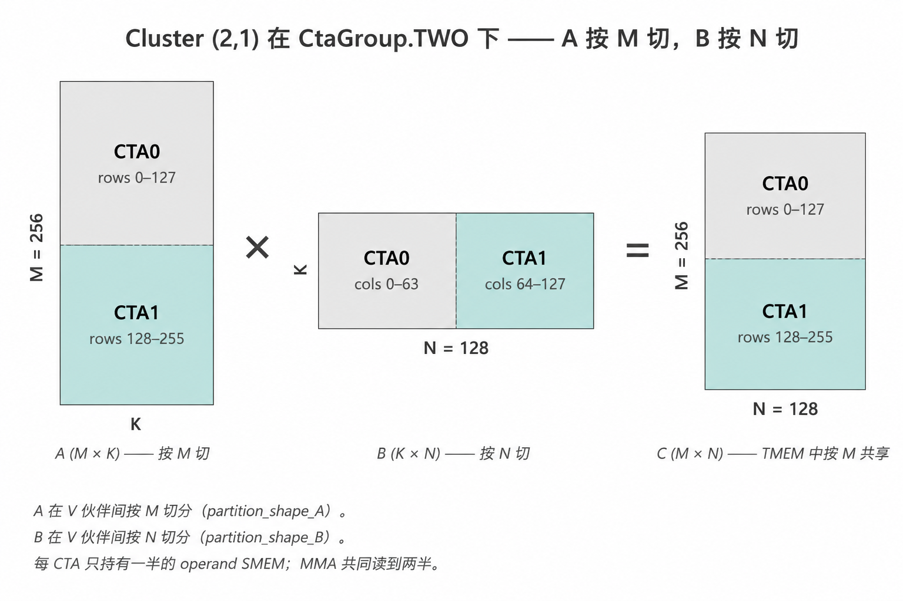
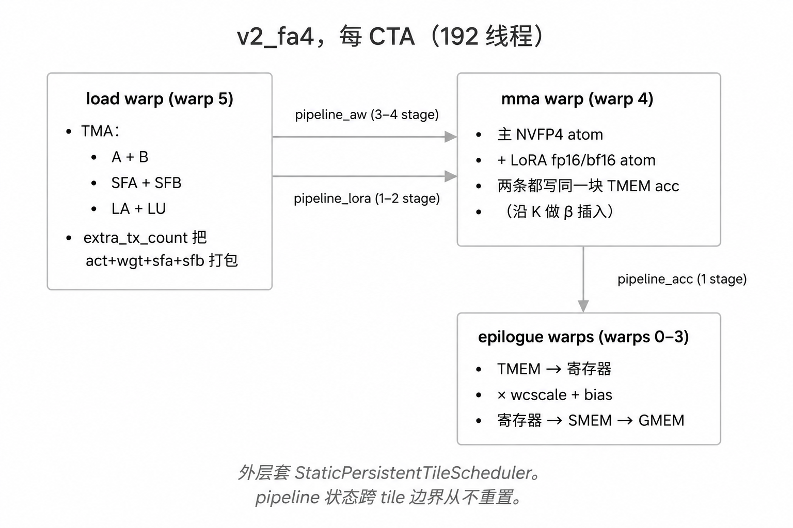
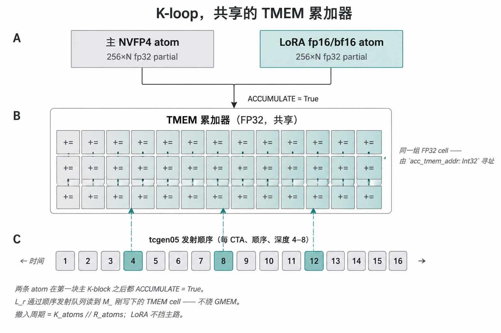

# Blackwell 上的 SVDQuant W4A4 算子实现 —— 基于 FA4 骨架的 warp 专用化、TMEM 与 2-CTA 持久化内核导览

*如何让 Blackwell kernel 在复杂的流水线同步状态空间里不死锁 ——
借用 FlashAttention-4 的同步骨架（显式 per-warp 流水线状态 +
warp 专用化 + 持久化 tile scheduler），而不是自己从头写一套
状态机。以本仓库 `gemm_w4a4` 为例：从 1-CTA 的 CUTLASS 例程直译版
重构成 FA4 衍生的 2-CTA 持久化内核，以及那一行藏在"看上去能跑"
smoke 背后、价值 +198 % TF 的 SMEM 账目 bug。*

代码：[`ultism/svdquant-kernels`](https://github.com/ultism/svdquant-kernels)。
这篇文章的大量细节都活在仓库源码里 —— 行号、PTX、内核 docstring、
gotcha 文档 —— 建议配合仓库（以及一个能浏览仓库的 AI）一起读。

## 1. 前言



数字是 MFU（占该芯片 dense NVFP4 峰值的百分比）。**两边不是同代芯片**：
我们在 B200（SM_100，dense FP4 峰值 10 PFLOPS）上跑；nunchaku 的 NVFP4
在 `__CUDA_ARCH__ >= 1200` 上 gated，没有 SM_100 二进制，只能跑在
SM_120a/121a 的 RTX PRO 6000（4 PFLOPS 峰值）上 —— 两套 tensor core
ISA、两条工具链、两代 Blackwell。MFU 已经把芯片峰值除掉了，但**这张表
不是用来判断哪一边代码"写得好"的**，它只是一个**实现品质参考点**：
"成熟手写 inline PTX 在它自己的目标芯片上能跑多快"。同一台 B200、
剥掉 LoRA 和仿射、用 CUTLASS 的 `dense_blockscaled_gemm_persistent.py`
在 2-CTA 256×256 上跑出来的本地天花板是 45 %–63 % MFU；**那**才是还真
值得追的剩余空间。

这个算子是 SVDQuant 里 compute-bound 的那一半：NVFP4 scaled-MMA + 小规模
的低秩 LoRA 残差 + 按列仿射。数学一行写得下；实现几乎用尽了 SM_100 /
SM_103 比上一代多出来的全部原语。

仓库里有两版内核共存。**v1**（`cute_kernels/gemm_w4a4/kernel.py`，1-CTA、
单体 `@cute.kernel`、stock `cutlass.pipeline.PipelineState`）在生产 shape
上卡在 ~27 % MFU；想把它升到 2-CTA 走 `cta_group=TWO` 的第一阶段尝试
得到的基本是零增益（28 % vs 27 %）。**v2_fa4**
（`cute_kernels/gemm_w4a4/kernel_v2_fa4.py`，FA4 衍生的 warp 专用化、
三 pipeline、2-CTA 持久化）是出货面，跑出上面那组数字的就是它。

整个项目里单行改动 ROI 最高的一处：把 2-CTA 模式下每个 CTA 对
LoRA-up 权重块的 SMEM 字节数估算减半。kernel 在 trace time 解一道
SMEM 预算的题 ——"每个 SM 给的共享内存这么多，主 K-loop 能同时
放几个 K-block 在飞？LoRA 那条预取又能跑多少 stage？"。LoRA-up
那一块手写了一行算术，少算了一件事：2-CTA 模式下硬件已经把这块
tile 在 cluster 内两个 CTA 之间分了，每个 CTA 实际拿到的片上分配
只是公式给的一半。预算求解器拿到这个虚高了一倍的数字，为了给
"其实不存在的"共享内存让位，悄悄把主 K-loop 的并发深度从 4 个
in-flight K-block 砍到了 2 个。症状是：**没有症状** —— trace 通、
kernel 跑、数值对、看上去就是"有点慢"。改法：在那一行后面多除一次
cluster 的 CTA group 大小。生产 shape 上的墙钟：**566 TF → 1685 TF
（+198 %）**、**4.2 % → 16.9 % MFU**。同样 launch 配置下的 ncu A/B：
Duration −31.2 %、SM Throughput +11.99 pp、SM Active Cycles −36.3 %。
提交 `7296e90`；完整数据在 §7。

这篇博文把这两个故事放一块儿写，因为它们本来就是同一个故事：LU SMEM
这条 bug 只有在 FA4 重构把 2-CTA 全链路打通**之后**才暴露得出来，而
LU SMEM 的修复之所以有价值，又是因为 FA4 重构把预算求解器放到了能真正
干活的位置上。

## 2. 为什么是这个算子，为什么写这篇博文

数学：

```
y = scaled_mma(act₄, wgt₄) · wcscale + bias + lora_act_in @ lora_up
```

输入是 NVFP4 打包格式（`act, wgt: [M, K/2]` uint8，每字节存两个 E2M1
nibble；`ascales, wscales: [K/16, *]` FP8-E4M3，按 16 个 K 一块的 scale）。
`lora_act_in @ lora_up` 是小秩 R 残差（生产里 R ≤ 128，最常见 R=32）。
`wcscale` 和 `bias` 都是按输出列的。没有链式数据流，没有 softmax，没有
在线修正：一个主 MMA、一个 LoRA MMA、一个融合仿射。

下面两条设计约束决定了后面所有内容：

- **只做 SM_100 / SM_103**。消费级 Blackwell SM_120a/121a 由 nunchaku
  覆盖（架构矩阵见 `nunchaku/setup.py:41-64`），本仓库的存在意义就是
  把数据中心 Blackwell 这条线补上，Ampere–Hopper 也都不在范围里。因此
  内核可以无条件假设 `tcgen05` scaled-MMA、TMEM、2-CTA dense MMA、TMA
  捆绑等等。
- **CuTe DSL Python，不是 CUDA C++**。Python DSL 是 NVIDIA 在 Blackwell
  上的官方撰写路径，跟上游用的同一个 `cutlass-dsl` 包；相比 CUDA C++ 的
  CuTe 头文件，模板样板少 ~10×。真正的 kernel 在首次调用时通过
  MLIR → PTX JIT。Trace 级检查在任意 Linux 盒子都行（本地卡撒谎报错就
  设 `CUTE_DSL_ARCH=sm_100a`）；真实执行得 B200/B300。

铺垫到这里。这篇博文要立的编辑主张：**在 Blackwell 原语教学这件事上，
这个算子比 FA4 更适合做教材**。FA4 的在线 softmax 和 S→P→O 链式数据流
都有真正的认知税 —— FA4 的复杂性大半其实不在 Blackwell，而在
注意力本身。SVDQuant W4A4 把那一层剥掉了：同样的 warp 专用化主循环、
同样的持久化 tile scheduler、同样的 `tcgen05` 累加器、同样的 TMA 捆绑、
同样的 2-CTA 切分 —— 但数学只占一屏。要想通过读一个真正的生产内核去
学 Blackwell 原语，这个算子是更干净的读物。

## 3. 这个内核用到的 Blackwell 原语

默认读者会 CUTLASS 2.x + CUDA。下面是 SM_100/SM_103 新增的部分，大致按
内核里实际碰到的顺序来。

### 3.1 `tcgen05.mma` scaled-MMA 与 NVFP4 atom

NVFP4 是块缩放 FP4：两个 E2M1 nibble 打包到一个字节作为数值，再加每 16
个 K 元素一个 FP8-E4M3 的 scale。算上块 scale 后有效精度约 7 bit。
Blackwell 的 `tcgen05.mma.kind::mxf4nvf4.block_scale.scale_vec::4X` atom
两个 packed operand 加两个 scale tensor 同时进来，输出一个 FP32 累加器
落到 TMEM。

CuTe DSL 通过 `make_blockscaled_trivial_tiled_mma(...)` 把这条暴露
出来。值得知道的：它在 Blackwell 上**只暴露 MXF4、NVFP4、MXF8** 三种
scaled-MMA —— **NVFP4 落地的同时 INT4 scaled-MMA 在 ISA 层就被砍了**。
（Ascend 的 cube unit 仍有 INT4 MMA，这也是为什么仓库的 Ascend pod
保留 INT4 而 CUDA pod 走 NVFP4 —— 框架层数学一致，内核层按硬件特化
格式。）

atom 通过 `tiled_mma.set(tcgen05.Field.SFA, …)` 和 `.SFB` 两个运行时
入口接受 scale。scale 住在 **TMEM**（不是 SMEM）：内核每 K-block 工作
量 `cute.copy` 一次 SMEM → TMEM，然后再发 `gemm`。用法在
`kernel_v2_fa4.py:1339-1346`：

```python
tiled_mma.set(tcgen05.Field.SFA, tCtSFA[sf_kblock_coord].iterator)
tiled_mma.set(tcgen05.Field.SFB, tCtSFB[sf_kblock_coord].iterator)
cute.gemm(tiled_mma, tCtAcc, tCrA[kblock_coord], tCrB[kblock_coord], tCtAcc)
```

前三行是 **Python trace 期的对 `tiled_mma` 对象的状态修改** —— 它对随后
那个 `cute.gemm` 在 MLIR 里捕获时生效。第四行才是真正在设备上发出去的
`umma.commit`。

**关于这里说的 "NVFP4" 与 cuBLAS NVFP4 linear 的差**：完整 NVFP4 spec
是**两级** scaling —— 一个 per-tensor FP32 scale，再加一个每 16 个 K
元素一个 FP8-E4M3 block scale。nunchaku 的设计选择是只用一级：block
scale，任何 per-tensor scaling 都在离线 calibration 时折进 block scale
（或折进 `wcscale`）。我们这个内核沿用 nunchaku 的同一套数学，因此也是
单级 NVFP4。cuBLAS 的 NVFP4 linear 则在运行时把两级都暴露出来。在
per-tensor scale 离线折好的前提下两者数学等价；差别在 spec 把什么带
到运行时 API，不在可达精度。我们跟 nunchaku 走是因为 LoRA + `wcscale`
那一套本来就自然吸收了 tensor 级 scale。

### 3.2 2-CTA dense MMA via `cta_group=TWO`

`cluster_shape=(2, 1)` cluster 里的两个 CTA 协同处理一个更大的 tile。
atom 用 `CtaGroup.TWO` 构造，会在 MMA 的线程布局里插一个大小为 2 的
`V`（volume）维。pair 里每个 CTA 各持有 cluster 级工作的一半，但 leader
CTA 发出去的每一条 MMA 两个 CTA 都参与。

cluster layout 因式分解成 `(V, M, N, K)`：

```
cluster_shape_mn = (2, 1)，CtaGroup.TWO：
  cluster_layout_vmnk.shape = ((2,), 1, 1, 1)
  rank=0 → flat coord (0, 0, 0, 0)   ← leader CTA
  rank=1 → flat coord (1, 0, 0, 0)   ← follower CTA
```

（在 2-CTA 下从 `cluster_layout_vmnk` 里读哪个 index 才能恢复每个 CTA
的 M 位置，是那种属于"代码理解 gap"的坑、不该塞进讲原语的正文里；写在
`docs/gotchas/cute_dsl.md:90-151`，要看自取。）

SMEM 红利来了。在 `CtaGroup.TWO` 下，MMA atom 的 `partition_shape_A`
会沿 M **halve** A，`partition_shape_B` 沿 N halve B。每 CTA 只需要装
1-CTA atom 一半的 operand SMEM —— 这就是 Modular `matmul-on-blackwell-
part-3` 那篇里说的 "2xSM MMA: Shared Memory Optimization"。CUTLASS 的
`dense_blockscaled_gemm_persistent.py` 用它，v2_fa4 主路径在 A、B 上也
用它（`kernel_v2_fa4.py:465-468`）。LoRA 路径里的 LU 算子**本来**也该
用它 —— 那是 §7 的事。



### 3.3 TMEM —— 可寻址的累加器空间

Blackwell 之前，MMA 的累加器在寄存器里，靠 `mma.sync` PTX 或 `cute::gemm`
搬。Blackwell 上累加器住在 **tensor memory（TMEM）** —— SM 局部的一块
内存，自带分配器（`utils.TmemAllocator`）、自带释放 barrier、自带 512
列宽的布局。两个直接后果：

- **TMEM 在 CTA 内部跨线程共享**，跟寄存器不一样。MMA warp 发完
  `cute.gemm`，CTA 里**任何**一组 warp 都可以后续通过
  `tcgen05.tmem_load` 把 TMEM cell 读出来送进 epilogue。这就是为什么
  4 个 epilogue warp 能读到 1 个 MMA warp 写的累加器。
- **两条 MMA atom 可以打到同一个 TMEM 范围**。FA4 的
  `blackwell_helpers.gemm_ptx_partial` 接受一个原始的
  `acc_tmem_addr: Int32`，不要 `cute.Tensor`。手里有了 TMEM 地址，就可以
  让第二条 `ACCUMULATE=True` 的 MMA 写到同一个地址；第二条 MMA 读到的
  正是第一条 MMA 写下的那些 TMEM cell。§6 里的 β-interleave 用这条把主
  NVFP4 MMA 和 LoRA fp16 MMA 累加到同一个 FP32 累加器，不走 GMEM、不走
  `cute.Tensor` 别名。

SM_100 上 TMEM 预算最多 **512 列**。NVFP4 block-scaled MMA 在 256×128
tile 上要 128 列累加器 + 16 列 SFA + 32 列 SFB ≈ 176 列；把累加器翻倍
（next-tile ping-pong 的 overlapping_accum）在 `tile_n=128` 还能塞下、
在 `tile_n=256` 就崩。所以两边（CUTLASS 参考和我们）都写
`num_acc_stage = 1 if tile_n == 256 else 2`（gotcha 在
`docs/gotchas/cute_dsl.md:231-287`）。

### 3.4 TMA、`extra_tx_count` 捆绑、`is_leader_cta` 闸

TMA 拷贝是异步的，通过 `mbarrier` arrive 信号完成。每次 TMA 给 barrier
的 `expected_transactions`（`tx_count`）加上它送达的字节数；累加到阈值，
barrier 翻 full，consumer 可以放行。CuTe DSL 的
`pipeline.PipelineTmaUmma.create` 把这一套打包成 producer/consumer
pattern。

包装里有两个 SM_100 专用旋钮：

- **`extra_tx_count`** 做捆绑。本来一条 TMA 一个 barrier；现在把多条 TMA
  的字节数加进同一个 barrier 的 `tx_count`，一个 barrier 守多条 TMA。
  主 K-loop 里 `act + ascales + wgt + wscales` 四条 TMA 用一个 barrier，
  `tx_count = num_tma_load_bytes`（`kernel_v2_fa4.py:906-914`）。省下三个
  mbarrier slot 和每 stage 一次 barrier wait。
- **`is_leader_cta`** 做 2-CTA 簿记。`CtaGroup.TWO` 下只有 cluster pair
  里的 leader 调用 `arrive_and_expect_tx`（另一个 CTA 的 TMA 参与隐含在
  `tx_count` × `cta_group_size` 里）。如果 follower 也 arrive，barrier
  会重复计数然后死锁。CuTe DSL 在 `PipelineTmaUmma.producer_acquire` 里
  按 `cluster_layout_vmnk` 自动加门 —— 内核把 layout 塞进去就完事。

### 3.5 `StaticPersistentTileScheduler`

套路：launch `min(num_tiles, sm_count)` 个 CTA，每个 CTA 沿
`tile_idx += grid_dim()` 走 tile，越界就退出。省 launch 开销、跨 tile
保 warp 热、TMA pipeline 跨 tile 带状态。

实现量很小 —— FA4 的 `tile_scheduler.py::StaticPersistentTileScheduler`
~30 行，我们的等价物 inline 在 `kernel_v2_fa4.py:885-892`。难的不是
scheduler，是内核里**其它**部分的状态能不能跨 tile 边界活下去 —— 那是
§5 的内容。

### 3.6 Warp 专用化（预告）

一个 warp 做 TMA load（`load` warp），一个 warp 发 MMA（`mma` warp），
四个 warp 跑 epilogue（`epilogue` warps）。一共 6 warp × 32 线程 = 每
CTA 192 线程。每个 warp 有自己的 pipeline 状态，独立推进 —— 没有"内核
全局状态"这个东西。

这是 FA4 给 `tcgen05` + TMEM 这一族内核定下的结构性 pattern。完整图景
（3 pipeline × 3 warp group + 每 warp `PipelineStateSimple`）在 §6。

## 4. v1 —— FA4 之前的基线

`cute_kernels/gemm_w4a4/kernel.py` 是 v1：主 NVFP4 scaled-MMA + β-
interleaved LoRA，只跑 1-CTA、单体 `@cute.kernel`、stock
`cutlass.pipeline.PipelineState`。docstring 把出身写得很坦白：从
`cutlass/examples/python/CuTeDSL/blackwell/
dense_blockscaled_gemm_persistent.py` 移植过来，剥掉了持久 TileScheduler、
clusters > 1、TMA multicast、`overlapping_accum`、`tile_n ∈ {64, 192}`
的 SFB-shift 黑魔法。两个 shape 自适应的 1-CTA tiler：小 M 用 `(128,
128)`，其余用 `(128, 256)`。

v1 是**对**的第一步：找一份已知能跑的 CUTLASS 例程，留下里面明显
可泛化的部分，把 LoRA β-interleave 接到同一个 TMEM 累加器上
（`kernel.py:30-33` 引用了 TV-layout match 校验），先发一版数值干净的
内核，再谈优化。

### 4.1 v1 干得不错的地方

- **数值干净**。{fp16, bf16} × {1-CTA} × R ∈ {32, 128, 256} smoke
  22/22 通过。LoRA β-interleave 的数学（一个 MMA warp 拥有发射流，
  每 `stride = K_atoms // R_atoms` 个主 atom 撒一个 LoRA atom，两条
  atom 写同一个 TMEM acc）跟 v2_fa4 一致 —— 这部分设计从 v1 起就
  稳定（见 `docs/kernels/gemm_w4a4.md:26-115`）。
- **别名 tensor LoRA acc 可行**。两条 MMA atom（主 NVFP4 + LoRA fp16）
  通过两个底层地址相同的 `cute.Tensor` 对象写到同一个 TMEM cell。
  trace 期校验主 `partition_C` 和 LoRA `partition_C` 的 TV-layout 一致，
  保证两条 atom 写的是同一组 cell，不只是同一段字节范围。
- **shape 自适应 tiler**。小 M（M=256）用 `(128, 128)`；大 M 用
  `(128, 256)`。`(128, 256)` 变体自动拿到 `num_acc_stage = 1`，因为
  `tile_n=256` 在 `num_acc_stage = 2` 下会爆 TMEM 预算；`(128, 128)`
  免费拿到 overlapping_accum 的 ping-pong。

### 4.2 v1 撞墙的地方 —— vs CUTLASS 同硬件同 shape

同 B200、同 shape，v1 对 CUTLASS 自家
`dense_blockscaled_gemm_persistent.py`（只跑主 NVFP4 MMA，不带 LoRA；
严格对应我们 v0 干的事）：

| shape (M, K, N)     | CUTLASS 1-CTA 128×256 | CUTLASS 2-CTA 256×128 | CUTLASS 2-CTA 256×256 | ours 1-CTA  | ours 2-CTA Phase 1 |
| ------------------- | --------------------- | --------------------- | --------------------- | ----------- | ------------------ |
| 4352 × 3840 × 3072  |   3847 TF  38.5 %     |   4202 TF  42.0 %     |   4545 TF  45.4 %     | 1309 TF 13.1 % | 1185 TF 11.8 %  |
| 4352 × 3840 × 15360 |   4167 TF  41.7 %     |   5181 TF  51.8 %     |   5836 TF  58.4 %     | 2735 TF 27.4 % | 2599 TF 26.0 %  |
| 4352 × 15360 × 3840 |   4096 TF  41.0 %     |   5903 TF  59.0 %     |   6339 TF  63.4 %     | 2646 TF 26.5 % | 2964 TF 29.6 %  |
| 4352 × 10240 × 3072 |   4174 TF  41.7 %     |   5375 TF  53.8 %     |   6074 TF  60.7 %     | 2299 TF 23.0 % | 2350 TF 23.5 %  |

（出处：`cute_kernels/gemm_w4a4/README.md:154-160`。CUTLASS 列跑的是
v1 在 v0 模式下做的事 —— 只主 NVFP4，所以比较是 apples-to-apples。）

表里有两条不好辩的事实：

1. **同 tile（128×256，1-CTA）下，CUTLASS 比我们快 ~14 pp**。持久
   scheduler、多 stage MMA/epilogue overlap、更细致的 pipeline 纪律。
   这些在 v1 架构里**不是**做不出来 —— 就是没做。
2. **2-CTA Phase 1 基本拿了零**。我们的 2-CTA 列每个 shape 都落在 1-CTA
   列 1–3 pp 范围内，有的还更慢。CUTLASS 的 2-CTA 256×128 列 —— FLOPs-
   per-atom **跟** 1-CTA 128×256 一样 —— 在同硬件上抬升 10–18 pp。
   2-CTA 的机制对 CUTLASS 是 work 的；在 v1 架构里就是 work 不起来。

### 4.3 诊断

只要尝试把 v1 抬到 2-CTA 持久化，内核需要跟踪的状态空间就沿五个维度
同时扩张：

1. **Pipeline stage**。N 个 A/B SMEM stage，每 stage 一个 mbarrier、
   一个 phase bit、一个 index。
2. **2-CTA pair barrier**。`cta_group=TWO` 下每个 TMA barrier 都要知道
   cluster 里两个 CTA，过 `is_leader_cta` 闸，`tx_count` 里要烘进
   `cta_group_size`。
3. **持久 tile loop**。tile 边界不排干 pipeline；状态从 tile N 活到
   tile N+1。
4. **LoRA β 第二条 MMA**。第二条 atom 插进主 K-loop，自己有 LoRA 前奏
   SMEM 的 producer/consumer 周期。
5. **Epilogue 校正链**。最终在 epilogue 里融合 `× wcscale + bias`，
   per-column 因子自己有 SMEM 排级。

stock `cutlass.pipeline.PipelineState` 是隐式的（状态藏在
`PipelineTmaUmma`/`PipelineUmmaAsync` 包装的 `advance()` 方法里随调用
演化）、分支的（每次调用根据当前 phase 走不同代码路径）、单维度的
（每个 pipeline 一个 `PipelineState`，每个 warp 角色一个 pipeline）。
它干净处理维度 1。它不和维度 2–5 组合 —— 经验证据很锋利：之前的一个
持久化移植（kernel.py-类，提交 `61905df`）**在 1-tile-per-CTA 下数值
正确，到每 CTA 处理 ~20 tile 时挂死 500×**。这是 phase/state 跨 tile
边界漂移的经典签名：状态机对第一圈正确，从此累积误差。

修法不是"把 v1 调得更狠"，是把状态机整套换掉。下一节。

## 5. 为什么是 FA4 —— 我们采用的脚手架

FA4（Flash-Attention 4 在 Blackwell 上的前向，源码在
`flash-attention/flash_attn/cute/`）在另一个算子上已经解决了上面
那个 5 维状态空间问题：注意力。解法是把 pipeline 状态**显式化、per-
warp 化**，把持久 tile loop 拎成内核最外层结构，把每个 Blackwell 专用
的脚滚雷因式分解成有名字的原语。我们没拿走 FA4 的**数学** —— 我们的
算子里没有在线 softmax、没有 S→P→O 链式数据流、没有 Q/K/V 切分 ——
但我们整套地接过了**脚手架**。

### 5.1 从 FA4 接过来的部分

- **Warp 专用化主循环**（`flash_fwd_sm100.py`）。分开的 `load()`、
  `mma()`、`epilogue()` 三个方法，每个跑在指定 warp 段。我们的
  `mma` 继承了 FA4 在他们代码里 `tiled_mma_qk + tiled_mma_pv` 的
  "一个 warp 跑两条 MMA" pattern —— 但 FA4 把两条 MMA 链起来（QK 输出
  喂 PV 输入，经 TMEM 转手），我们让**两条** MMA 都打到同一块 TMEM
  累加器区做 β-累加。数学不同，warp 结构相同。
- **`PipelineStateSimple`**（`pipeline.py`）。每个 warp、每个 pipeline
  一个 state 对象。单个 `_phase_index` 计数器 —— `index =
  phase_index % stages`、`phase = (phase_index // stages) & 1`。纯除模，
  没有分支 `advance()`。`_w_index_phase` mixin 让每个 warp 独自驱动
  状态、不需协同。`_pipeline_simple.py`（82 行）就抄在
  `cute_kernels/gemm_w4a4/_pipeline_simple.py`。
- **`PipelineTmaUmma`，带 `extra_tx_count` + leader-CTA 闸**。FA4 在
  `cutlass.pipeline.PipelineTmaUmma.create` 上加了 `extra_tx_count`
  （多条 TMA 共享一个 barrier）和 `is_leader_cta` 闸（2-CTA 感知）。
  这两个旋钮都是我们需要的；上游包装本身暴露它们，但隐式
  `PipelineState` 的流程用不到。
- **`StaticPersistentTileScheduler`**（`tile_scheduler.py`）。30 行，
  即插即用。grid 钳到 `sm_count`，`tile_idx += grid_dim()`。
- **`gemm_ptx_partial`**（`blackwell_helpers.py`）。接受原始
  `acc_tmem_addr: Int32`。两条 MMA 可以打到同一个 TMEM 区，不必走
  `cute.Tensor` 别名 —— v1 走的是别名（两个 `cute.Tensor` 指同一个
  地址）。在 v1 里能跑（单 tile，一次 trace），但持久 loop + ACCUMULATE
  状态 trace 冻结的组合下别名套路就脆。
- **`AI/DEBUG_2CTA.md`** —— FA4 在 kernel 旁边丢了一份调试 markdown，
  把每个 2-CTA 脚滚雷都列出来（tx_count × `cta_group_size`、phase 奇偶、
  `cta_group=TWO` 下 `producer_tail` 死锁、`tcgen05.commit` 空 group）。
  bring-up 阶段帮我们省了一周；每次实战碰到一条就把它移植进
  `docs/gotchas/cute_dsl.md`。

### 5.2 **没**从 FA4 拿的部分

这是本节的编辑取舍。FA4 是注意力内核；它的复杂性大半是注意力的复杂性。
具体：

- **在线 softmax**。和 GEMM 无关。running max + rescale 不是 Blackwell
  pattern，是注意力 pattern。
- **S→P→O 链式数据流**。FA4 的 QK 输出（S）softmax 成 P，再喂 PV
  （V matmul）。这条链子约束了两条 MMA 怎么用 TMEM。我们的 β-interleave
  把两条 MMA 放进**同一个**累加器 —— 不链，是累加。MMA-warp 结构相似，
  TMEM 簿记简单得多。
- **Q/K/V 切分**。注意力里有三个张量角色；我们这里只有一个 weight、
  一个 activation、一对 LoRA。不同。

结果是：把 FA4 脚手架适配到 SVDQuant W4A4 反而**剥掉了** FA4 较硬的那
部分。如果你读过 FA4 并理解了 warp 专用化 pattern，这个内核是更干净的
第二个示例 —— 动件少，但原语一致。

## 6. v2_fa4 —— 重写

当前的文件是 `cute_kernels/gemm_w4a4/kernel_v2_fa4.py`。它是 FA4 衍生
重写的第三个真实迭代：v0_fa4（无 LoRA，仅脚手架）、v1_fa4（= v0_fa4 +
单 stage LoRA，作为参考数字保留在隐藏代码路径）、v2_fa4+C1（= v1_fa4 +
2-stage LoRA 前奏 + `× wcscale + bias` 融合 epilogue + §7 那条 LU SMEM
fix）。出货是 LU 修复后的 v2_fa4+C1；下文描述的就是这个出货面。



### 6.1 v0_fa4 —— 不含 LoRA 的脚手架

FA4 衍生分支的第一次提交是 `kernel_v0_fa4.py`：FA4 骨架，无 LoRA，
无 wcscale/bias。目的：在重新插 LoRA 之前先把新的状态机器单独验通。

数字，生产 shape `M=4352 K=3840 N=3072` fp16：

|             | 1-CTA   | 2-CTA   |
| ----------- | ------- | ------- |
| v0_fa4      | 7.7 %   | 7.6 %   |

（出处：`cute_kernels/gemm_w4a4/README.md:183-189`。）比 v1 的 27 % 低
—— 但这是意料之中的。v0_fa4 是个 partial-feature 脚手架；多 stage
pipeline 还没调，overlapping_accum 也还没接，墙钟里全套 FA4 pattern
（多 pipeline 初始化、tile scheduler 开销、warp 专用化 barrier 集合）的
费用都还没被后续优化摊掉。我们把它冻起来当 v0/v1 reference（用
`enable_lora` flag 闸住，同一份文件能两用），就往前走了。

v0_fa4 在设备上的第一次跑出了整个项目最干净的一条 bring-up bump，单开
一节。

### 6.2 Bump（inline）：首次 smoke 9 分钟挂死

**症状**：在 Modal 上 launch、`nvidia-smi` 显示 GPU 在忙、9 分钟没有
stdout、然后 Modal 容器超时。没有 abort、没有 assert、没有 PTX 错 ——
就是干净地卡住。

**原因**（根因分析在
`docs/kernels/gemm_w4a4_fa4_v0_bringup.md:27-44`）：MMA warp 的
单 stage `pipeline_acc` 的 producer phase 初值是 `Int32(0)`。
`pipeline_init_arrive` 在内核启动时跑，把 empty mbarrier 预先 arrive
到 parity 1。MMA warp 调用 `producer_acquire` with phase 0 —— 这意思是
"等 barrier 翻到 parity 0"。但 consumer（epilogue warp）还没跑、barrier
还在 parity 1、MMA warp 死等。

**修法**：把 `acc_producer_phase` 初值改成 `Int32(1)`。这跟 stock
`cutlass.pipeline.make_pipeline_state(Producer, ...)` 底下返回的一致，
也跟 FA4 在 `load()` 注释里写的 "single-stage producer starts at 1"
对得上。两字符 patch：

```python
# kernel_v2_fa4.py:1247-1253
# Single-stage pipeline_acc — phase bit only (XOR toggle).
# Producer starts at phase=1: `pipeline_init_arrive` pre-arms
# the empty barrier to parity=1, so the first `producer_acquire`
# with phase=1 returns immediately. Starting at 0 blocks forever
# (consumer never flips full, kernel hangs — was the 9-min hang
# on first smoke). Mirrors stock `make_pipeline_state(Producer)`.
acc_producer_phase = Int32(1)
```

**从 bring-up 里带走的教训**：在显式 per-warp pipeline 状态下，初值
不变量是你自己的事。没有 `cutlass.pipeline.make_pipeline_state` 替你
搞这事；包装也不替你搞。初值 phase 错一个 bit，内核就静默挂死。
bring-up 文档里还列了它的兄弟问题（Bug 2/3，跨持久迭代的 ACCUMULATE
状态 trace 冻结，修法是把 K-tile 循环写成 Python `range()` 全展开而
不是 `cutlass.range(unroll=1)`）。

### 6.3 重新加上 LoRA —— 共享 TMEM 上的 β-interleave

LoRA 校正项 `lora_act_in @ lora_up` 很小（R ≤ 128）。如果和主 MMA 串行
跑（"α" 变体），在最差生产 shape 上墙钟会膨胀 ~50 %，因为 `tcgen05`
异步发射队列深度 4–8，atom 数量极少的 LoRA pass 喂不满它（完整分析在
`docs/kernels/gemm_w4a4.md:26-52`）。修法是 β：把 LoRA atom **撒进**
主 K-loop 的发射流里，让 pipe 永远不只见到 LoRA。

机制立在三条 Blackwell 事实上：

1. **`tcgen05` 发射队列在每 CTA 内顺序**。后入队的 atom 看得到先入队
   atom 的效果。所以排在主 atom *k* 之后的 LoRA atom 能看到主 atom *k*
   的 TMEM 写入。
2. **两条 atom 可以打到同一个 TMEM 地址**。通过
   `gemm_ptx_partial(acc_tmem_addr: Int32)`，两条 atom 写到同一组
   FP32 累加器 cell。不需要 `cute.Tensor` 别名套路（v1 走的别名路；
   能跑，但更难维护）。
3. **TV-layout match**。主 NVFP4 atom 和 LoRA fp16/bf16 atom 把 per-CTA
   `cta_tile_shape_mnk` 切到 per-thread 寄存器 fragment。β 要 work，
   线程 t 在两条 atom 下的"第 i 个元素"必须落在**同一个** TMEM cell。
   匹配是 trace 期校验的（内核 docstring 在 `kernel_v2_fa4.py:1261-1270`
   引用；原始校验通过 `cute_kernels/gemm_w4a4/verify_tmem_layout.py` 在 bring-up 期跑，
   `1SM 128×256` 和 `2SM 256×256` 都验过）。

interleave pattern 本身就是 K-loop 主 atom 每次多一个分支。
`stride = K_atoms // R_atoms` 控制 LoRA atom 多久发一次；`r_next` 和
`next_lora_at` 跟踪当前哪个 LoRA atom 上场、下次发在哪。源码在
`kernel_v2_fa4.py:1309-1376`：



值得理解的 MLIR trace 细节：`tiled_mma.set(tcgen05.Field.ACCUMULATE,
...)` 是 **Python trace 期对对象的修改**。每个 `cute.gemm` 调用点在
trace 时捕获当时的字段值；运行时不会再执行 setter。所以 K-tile 循环
必须是 Python 全展开（`for k_tile in range(k_tile_cnt):`，而不是
`cutlass.range(unroll=1)`），因为后者 trace 一次循环体、然后会把第一个
kblock 位置上的 `ACCUMULATE=False` 捕获给**每个** tile 复用 —— 这会在
每个 tile 边界把累加器擦掉。当前内核正是因为这条用的 Python `range`，
注释在 `kernel_v2_fa4.py:1294-1306`。

### 6.4 Bump（inline）：2-CTA LoRA 回归

把 LoRA 用单 stage 前奏接回 FA4 骨架之后（我们记作 `v1_fa4` 的配置），
2-CTA 路径**反退**：

| (M=4352 K=3840 N=3072 R=128 fp16) | v0_fa4（无 LoRA） | v1_fa4（1-stage LoRA） |
| --------------------------------- | ----------------- | ---------------------- |
| 1-CTA MFU                         |  7.7 %            | （未测量）             |
| 2-CTA MFU                         |  7.6 %            |  6.0 %                 |

（出处：`cute_kernels/gemm_w4a4/README.md:185-189`。）从**无** LoRA 到
**一个 stage 的** LoRA，2-CTA 路径反而**变慢**。这是病理性的 —— 即便
差的 LoRA，也该在 TFLOPS 上做加法，不该做减法。

诊断：LoRA SMEM（`LA + LU`）吃了预算。单 stage LoRA 前奏体积够大，让
预算求解器（`_compute_stages`）把主 K-loop 的 `num_ab_stage` 让出来换。
主循环 pipeline stage 少 → 在飞 `tcgen05` atom 少 → SM% 下来 → 墙钟
上去。修法有两块；显而易见的那块在 §6.5，**真正大头**的那块在 §7。

### 6.5 C1 —— 2-stage LoRA 前奏

把 `num_lora_stage` 从 1 抬到 2（任务追踪里的 `C1`）。两个 LA/LU 缓冲
ping-pong。代价：LoRA SMEM 翻倍。收益：前奏成本被摊到更多主 MMA 迭代
上，预算求解器把主路径的 stage 还回来一些，回归解开。

数字，LU SMEM 修复**前**（即 C1 单独的贡献）：

| shape (M=4352, K, N, R)     | v1_fa4（pre-C1）2-CTA | v2_fa4+C1 2-CTA | Δ        |
| --------------------------- | --------------------- | ---------------- | -------- |
| K=3840  N=3072  R=128       |   6.0 %               |  14.2 %          | +8.2 pp  |
| K=3840  N=15360 R=128       |  15.2 %               |  18.6 %          | +3.4 pp  |
| K=15360 N=3840  R=128       |  17.0 %               |  18.1 %          | +1.1 pp  |
| K=10240 N=3072  R=32        |  11.6 %               |  26.1 %          | +14.5 pp |

（出处：`cute_kernels/gemm_w4a4/README.md:185-189`。）C1 把"2-CTA LoRA
反而比 1-CTA 更费"这条反常消掉 —— 每个 shape 至少 +1 pp，最差 shape
（小 N 或小 R）拿到两位数 pp。

ncu 机制，在 Verda B200（counter 不受限）的生产 shape 上抓的：

| 指标                          | v2 stage0（LoRA off） | v2 stage1（pre-C1） | v2 stage2（C1） |
| ----------------------------- | --------------------- | ------------------- | --------------- |
| duration（µs）                |  42.0                 |  77.1               |  69.6           |
| SM throughput %               |  52.3                 |  54.6               |  41.2           |
| hmma 子管线 %（NVFP4 tcore）  |  60.5                 |  31.8               |  34.9           |
| warp cycles / issued inst     |  15.0                 |  18.6               |  25.9           |
| long_scoreboard cyc（L1TEX）  |  10.6                 |  13.8               |  21.8           |

（出处：`cute_kernels/gemm_w4a4/README.md:209-217`。）三条读法：

- **主 MMA 单独跑没问题**。stage 0（LoRA off）打到 60.5 % hmma 子管线
  利用率 —— 跟 CUTLASS 的 NVFP4 reference 在同硬件上的数字一致。FA4
  主 K-loop 不是任何 gap 的来源。
- **LoRA 前奏把 NVFP4 tensor pipe 利用率打掉一半**。stage 0 → stage 2
  把 hmma 从 60.5 % 砍到 34.9 %（−25.6 pp）。DRAM 吞吐三档都低
  （≤ 6 %），所以不是带宽 —— 是 L1TEX 等：`long_scoreboard` 周期从
  10.6 涨到 21.8。LA/LU SMEM 读 跟主 K-loop 的 A/B SMEM 消费串行了。
- **C1 是部分修复**。stage 1 → stage 2 把 duration 砍 9.7 %（77.1 →
  69.6 µs）、hmma +3.1 pp。但 per warp-cycle 的 L1TEX 等**反而升高**
  （13.8 → 21.8）。赢的是摊销：2-stage 前奏把成本摊到更多主 MMA 迭代。
  延迟根因（LA/LU load 跟 A/B SMEM 消费串行）没变。

顺手说一句：pre-C1 v1_fa4 → v2_fa4+C1 在最小 shape 上 ~2.4× 的加速并不
全是 C1 的功劳 —— 大头来自跟 C1 同一窗口落地的 LU SMEM 修复。C1 单独
的贡献就是这次 ncu A/B 给出的 −9.7 % / +3.1 pp。这是 §7 的有用背景。

### 6.6 融合 `× wcscale + bias` epilogue

v2_fa4 比 v1_fa4 多的最后一件事是把按输出列的仿射折进 epilogue warp。
数学：

```
y[m, n] = acc[m, n] * wcscale[n] + bias[n]
```

`wcscale` 和 `bias` 以 `[N]` 张量、`c_dtype` 形式进来。epilogue warp 把
TMEM → 寄存器 → mul-add → SMEM → GMEM 经 TMA store。SMEM 成本可忽略
（`tile_n` × `c_dtype.width`/8 = 256 或 512 B 每 buffer；v2 最多两 buffer），
账目算在 `wcbias_smem_bytes`（`kernel_v2_fa4.py:449-453`）里。
`pipeline_acc` 的 consumer 端增加了 store 前读广播因子的工作；producer
端不变。

为什么不另起一个 epilogue pass 而是折进去：省一次 TMEM → SMEM → 寄存器
来回、省一次 TMA store、省一组 mbarrier。代价：~80 行 epilogue-warp 代码。

## 7. 静默的 SMEM 预算 bug —— LU ÷ cta_group_size

英雄发现。单行 patch，在生产 shape 上 +198 % TF，整个发现过程是"我写了
一个 `cute.cosize` probe，2 分钟跑完"。这是让这篇博文值得写的一节。

### 7.1 手写公式

`Sm100GemmW4A4V2FA4._setup_attributes` 估算 LoRA 前奏需要多少 SMEM 字节，
以便 `_compute_stages` 在决定塞几 stage 主 K-loop 之前先从每 SM SMEM
预算里扣掉。修复前的算式：

```python
# kernel_v2_fa4.py —— 手写，修复前
la_bytes = mma_inst_shape_mn[0] * R * lora_ab_dtype.width // 8 // cta_group_size
lu_bytes = mma_inst_shape_mn[1] * R * lora_ab_dtype.width // 8     # ← bug
lora_smem_bytes = (la_bytes + lu_bytes) * num_lora_stage
```

LA 是 LoRA-down 激活，维度 `[mma_tile_m, R]`。LU 是 LoRA-up 权重，
维度 `[mma_tile_n, R]`。两者在 2-CTA 下都喂一个用 `cta_group=TWO` 构造
的 LoRA MMA atom。

LA 正确地除了 `cta_group_size`，因为 LoRA atom 用 `partition_shape_A`
沿 M 切（M-shard，跟主 A 同机制）。cluster shape 是 `(2, 1)`，所以每
CTA 持有一半的 M。

LU **没**除 `cta_group_size`。手写公式假设每 CTA 持有完整的
`mma_tile_n × R` 的 LU SMEM。

### 7.2 为什么这是 bug

在 `CtaGroup.TWO` 下，2-CTA dense MMA atom 同样**沿 N** 把 **B** 切到 V
伙伴上（N-shard，via `partition_shape_B`）。这正是 Modular `matmul-on-
blackwell-part-3` 那篇 "Shared Memory Optimization" 一节里说的 "2xSM
MMA halves the B tile" 优化；CUTLASS 在 `dense_blockscaled_gemm_
persistent.py` 里默认就这么做、连注释都没写，因为这是
`partition_shape_B` 的默认行为。

`sm100_utils.make_smem_layout_b(tiled_mma_2cta, ...)` 返回的 per-CTA
SMEM layout 已经是 `tile_n × tile_k` 的一半。所以当 LoRA 的
`make_smem_layout_b(...)` 构造 LU layout 时，LU layout **已经**是 per
CTA 一半大。手写估算重复算了一次。

### 7.3 为什么症状是"什么都没有"

这是危险点。LoRA SMEM 估算偏大不会 crash —— 它会让预算求解器悲观。
求解器以为 LoRA SMEM 比实际多吃 16 KB，于是从主路径里拿走 16 KB，把
`num_ab_stage` 从 4 钳到 2。内核 trace 通、跑得动、数值对，只是主
K-loop pipeline 深度被砍掉一半。

没有 assert、没有 shape mismatch、没有分配失败。`_compute_stages` 的
打印（如果你打开）说"stage=2 fits" —— 因为按悲观预算就只有 stage=2 能
塞。内核行为里**没**任何指向这条 bug 的迹象。墙钟是"慢但能跑"；ncu 说
"低 SM%、高 `long_scoreboard`"；你花一周去调 `num_lora_stage` 和 tile
几何，全都不动。

### 7.4 两分钟的 probe

发现 bug 的故事是值得带走的部分。`cute.cosize` 在 trace 期工作，返回
`Int32`，给出 layout 的实际 SMEM cosize —— 正是手写公式想估的量。在
`_setup_attributes` 里丢一个 print：

```python
print("la_one =", cute.cosize(slice_(self.la_smem_layout_staged,
                                     (None, None, None, 0))))
print("lu_one =", cute.cosize(slice_(self.lu_smem_layout_staged,
                                     (None, None, None, 0))))
```

捕获到的输出（生产 shape，R=128、fp16、2-CTA）：

```
[PROBE96] num_lora_stage=2 cta_group_size=2
[PROBE96] la_one cosize=16384 -> 32768 B (handwritten 32768 B, factor 1.000)
[PROBE96] lu_one cosize=8192  -> 16384 B (handwritten 32768 B, factor 0.500)
```

LA 跟手写值对得上（factor 1.000）。LU 是恰好一半（factor 0.500）。
bug 找到，120 秒。

### 7.5 修复

多写一个 `// self.cta_group_size`：

```python
# kernel_v2_fa4.py:429-444 —— 修复后
lora_smem_bytes = 0
if cutlass.const_expr(self.enable_lora):
    la_bytes = (self.mma_inst_shape_mn[0] * self.R
                * self.lora_ab_dtype.width // 8) // self.cta_group_size
    lu_bytes = (self.mma_inst_shape_mn[1] * self.R
                * self.lora_ab_dtype.width // 8) // self.cta_group_size
    lora_smem_bytes = (la_bytes + lu_bytes) * self.num_lora_stage
```

提交 `7296e90`。429-444 行的注释引用了 probe 工件和
`docs/gotchas/cute_dsl.md:289-347` 的 gotcha 条目。

### 7.6 生产 shape 上的 before/after

同一个 `bench_gemm_v2_fa4_c1.py` benchmark、fp16、2-CTA、
M=4352 K=3840 N=3072 R=128，pre-fix 在 B300 上、post-fix 在 B200 上（绝对
TFLOPS 跨卡可比；B200 的 NVFP4 峰值更低，所以"同 TF"也意味着我们在更
弱的卡上更快了）：

| 指标                          | pre-fix | post-fix | Δ           |
| ----------------------------- | ------- | -------- | ----------- |
| TFLOPS                        |   566   |  1685    | **+198 %**  |
| MFU（B200 10 PFLOPS NVFP4）   |   4.2 % | 16.9 %   | **+12.7 pp**|

（出处：`docs/gpu.md:286-296`。）同一台 Verda B200 上的 ncu A/B
（HEAD^ vs HEAD = 提交 `7296e90`，在两次跑之间用磁盘上换 kernel，
`num_lora_stage=2`，单次 launch）：

| 指标                    | pre-LU-fix | post-LU-fix | Δ                       |
| ----------------------- | ---------- | ----------- | ----------------------- |
| Duration                |  46.69 µs  |  32.13 µs   | **−14.56 µs / −31.2 %** |
| Compute (SM) %          |  41.63     |  53.62      | **+11.99 pp**           |
| Memory %                |  25.58     |  38.91      | +13.33 pp               |
| L1/TEX Cache %          |  28.50     |  44.75      | +16.25 pp               |
| L2 Cache %              |  24.57     |  36.18      | +11.61 pp               |
| DRAM %                  |   5.04     |   7.31      | +2.27 pp                |
| SM Active Cycles        |  72 433    |  46 126     | **−36.3 %**             |
| Memory Throughput       | 386 GB/s   | 561 GB/s    | +45 %                   |
| Grid / Block            | 148 / 192  | 148 / 192   | 完全一致                |

（出处：`docs/gpu.md:393-403`。）读起来很干净：同样的 launch shape、
同样的 occupancy，但 `num_ab_stage` 抬到 4 后 SM 侧 pipeline 喂饱
→ SM% +12 pp、SM Active Cycles 砍 36 %。L1/TEX 和 L2 吞吐成比例上升，
因为 TMA producer 现在有更多在飞 buffer 要填 —— 不是"省带宽"，是
"带宽在整个内核墙钟上更均匀"。DRAM 仍低（compute-bound 仍成立）。

### 7.7 为什么这能泛化 —— 教学内容

bug 是具体的（`lu_bytes` 多算一倍）。pattern 是普适的：**任何手写
SMEM 预算算式，只要它喂的是 stage 求解器、且对应的 operand SMEM 是
`make_smem_layout_{a, b}(tiled_mma_2cta, ...)` 出来的，就必须沿那个被
切分的轴除一遍 `cta_group_size`**。A 是 M-split（`partition_shape_A`
沿 M halve），B 是 N-split（`partition_shape_B` 沿 N halve）。2-CTA 下
两者都 per CTA halve，只是沿不同轴。

为什么会有人手写预算：`_compute_stages` 需要在 operand SMEM 真正分配
**之前**给出字节估算（layout 取决于 stage 数，stage 数取决于预算 ——
循环依赖）。手写公式是用来打破循环的，但在非主 operand 上很容易把
cta_group 的切分搞错。

更稳健的替代：先把 layout 建出来，回读 `cute.cosize`，用读回来的值做
预算输入。多写一点代码，但跟硬件真相一致。两条路都行；要规避的失败
模式是"手写公式 + 没人对照 `cute.cosize` 做交叉验证"。

`docs/gotchas/cute_dsl.md:289-347` 把这条记作未来自己看的一条 pattern，
带 probe 模板、症状描述（"no assert fires; numerics are still correct;
perf is just lower than it should be"）、apply 指南（"任何地方你手写的
SMEM 预算估算，只要 operand 来自 `make_smem_layout_{a, b}(tiled_mma_2cta,
...)`，就除一遍 `cta_group_size`。A 和 B 在 2-CTA 下都 halve，只是沿
不同轴。"）。

## 8. 用 Blackwell 内核作者的眼光读 ncu

LU SMEM 这个发现如果没有 ncu 就只是墙钟噪声 —— 47 µs 里有 14 µs 是
真的；但在 Modal（ncu 被封，见下）上你只会看到一个"慢"的墙钟和一份
"正常"的 `torch.profiler` activity，结论是"内核需要 tuning"，没有任何
具体方向。C1 的机制故事（前奏摊销 vs 延迟修复）就更难没 ncu 读出来 ——
duration 下来了你就出货了，永远不知道每 warp 的 `long_scoreboard`
其实涨了。所以这一节是方法论小结。

### 8.1 计数器访问 —— Modal 封、Verda 开

`CLAUDE.md` 执行环境一节写到的分工对任何要复现或扩展这项工作的人都
关键：

- **Modal**（快速迭代主机）在内核模块层设了
  `NVreg_RestrictProfilingToAdminUsers=1`。`torch.profiler(activities=
  [CUDA])`（CUPTI Activity）可用，给出 per-kernel 墙钟（launch 开销
  剥掉）。`nsys --trace=cuda,nvtx` 给出 kernel 时间线。**任何要读
  perf counter 的东西都会** `LibraryNotLoaded` —— `ncu`、`nsys
  --gpu-metrics-device`、`nvml` counter 查询都不行。
- **Verda**（深度 trace 主机）counter 不受限。`ncu --set detailed`
  给出 SOL、pipe 利用率、stall 原因。流程：在 Modal 上迭代，墙钟 +
  activity trace 解释不了某条 delta 时，把那个单独的 kernel 搬到 Verda。

### 8.2 最常被复制粘贴的一条 —— `hmma` 是 NVFP4 tensor pipe

`tcgen05` UTCQMMA 在 ncu metric tree 上跑在 **hmma 子管线**上。没有
独立的 `qmma_*` counter。grep `qmma` 拿不到任何东西，一下午就没了。
你要的 metric 是：

```
sm__pipe_tensor_subpipe_hmma_cycles_active.avg.pct_of_peak_sustained_active
```

覆盖 HMMA + UTCHMMA + UTCQMMA + UTCOMMA 一起。按累加器 dtype 拆 FLOPs：

```
sm__ops_path_tensor_op_utcqmma_src_fp4_fp6_fp8_dst_fp32
sm__ops_path_tensor_op_utcqmma_src_fp4_fp6_fp8_dst_fp16
sm__ops_path_tensor_op_utcomma_src_fp4_dst_fp32     # 单独的 FP4-only 路径
```

`--section ComputeWorkloadAnalysis` 自动拉出子管线分解。UTCQMMA 工作
在 SOL "Compute (SM) Pipe Utilization" 面板里挂在 "HMMA Pipe" 下。完整
清单见 `docs/gpu.md:105-127`。

### 8.3 2-CTA UMMA 内核要读的 SOL 分解

§6.5 的 C1 ncu 表是模板。读法：

- **SM throughput %** —— SM 各管线平均忙到什么程度。compute-bound 的
  NVFP4 GEMM 应该高；如果不高，看 hmma % 判断是不是 tensor pipe 具体
  在忙。
- **hmma 子管线 %** —— NVFP4 tensor pipe 忙到什么程度。这是关键
  数字。CUTLASS reference 在生产 shape 上 ~60 %；v0_fa4（无 LoRA）
  60.5 %（单测平手）；v2_fa4+C1（带 LoRA）34.9 %（LoRA 前奏拖）。
- **warp cycles / issued inst** —— 每条已发指令的平均周期数，IPC 的
  倒数。这个值上升意味着内核每条指令 stall 多了；跟
  `long_scoreboard cyc`（L1TEX 等）对照，把 stall 归因。
- **long_scoreboard cyc (L1TEX)** —— warp 在 L1TEX（SMEM）load 上的
  平均等待周期。我们 LoRA-on 配置里的主导 stall 原因。

要学的 pattern：hmma % 比 CUTLASS reference 低，跟 `long_scoreboard`
周期高，**不是同一个问题**。前者说"tensor pipe 闲"，后者说"warp 没活
可发"。两条可以同时成立，修法不同。

### 8.4 trace 期 `cute.cosize` probe 模式

解锁 LU SMEM 发现的唯一工具。两块机制：

1. CuTe layout 在 trace 期就知道 cosize。表达式 `cute.cosize(layout)`
   （或切过的 layout，比如 `slice_(self.lu_smem_layout_staged,
   (None, None, None, 0))` 砍掉 stage 维）。
2. 在 `_setup_attributes`（trace 期执行）里 print 它，值会在内核运行
   **之前**打到控制台。所以不需要设备侧仪表；诊断在 trace 期就 surface
   出来，一行 print。

模板，从 `docs/gotchas/cute_dsl.md:319-324`：

```python
print("la_one =", cute.cosize(slice_(self.la_smem_layout_staged,
                                     (None, None, None, 0))))
print("lu_one =", cute.cosize(slice_(self.lu_smem_layout_staged,
                                     (None, None, None, 0))))
```

逐一对比手写值。比 1.0 → 一致。比 0.5 或 2.0 → operand 在某个你没算到
的轴上被切了（或没被切）。2 分钟，可发现整类"手写预算偏差"bug。

## 9. 校准 —— 这个内核实际站在哪里

两个参考点；它们告诉你不同的事。

### 9.1 诚实的上限 —— 同 B200 上的 CUTLASS NVFP4

CUTLASS 自家 `dense_blockscaled_gemm_persistent.py` 是纯主 NVFP4 MMA
（无 LoRA、无 wcscale、无 bias）。同样的 atom，同样的硬件。在生产
shape 行（`M=4352 K=15360 N=3840`，K-heavy 那一条）：

| 变体                                | MFU      |
| ----------------------------------- | -------- |
| CUTLASS 1-CTA 128×256              |  41.0 %  |
| CUTLASS 2-CTA 256×128              |  59.0 %  |
| CUTLASS 2-CTA 256×256              |  63.4 %  |
| **v2_fa4+C1+LU-fix, fp16 2-CTA**   |  **27.3 %** |
| **v2_fa4+C1+LU-fix, bf16 2-CTA**   |  **27.3 %** |

（出处：CUTLASS 列 `cute_kernels/gemm_w4a4/README.md:156-160`；
v2_fa4 fp16/bf16 列 `docs/gpu.md:316-318`。）两条要带走的：

- **这块硬件上 NVFP4 的诚实上限是 ~60 % MFU**，不是顺嘴说的 30–40 %。
  这是用来校准的数字，不是"100 %"。
- **我们比那上限低 ~35 pp，做的事还更多** —— LoRA β-interleave +
  `× wcscale + bias` epilogue + LA/LU 前奏 TMA。CUTLASS 这些都不做。
  在完整 SVDQuant 算子上拿 27 % MFU 对一个 CuTe DSL 内核来说是合理的
  B200 第一版数字，离剩下那些 FA4-类优化（tile_n=128 上的
  `overlapping_accum`、配套预算手术的 tile 256×256）还没移植过去。
  剩下那 35 pp 是 §10 的活。

这不是"我们慢"的对比，是"上面还有多少空间、接下来从空间里拿什么"的
对比。

### 9.2 实现品质参考 —— RTX PRO 6000 上的 nunchaku

nunchaku 的 NVFP4 在 `__CUDA_ARCH__ >= 1200`（SM_120a/121a，见
`nunchaku/setup.py:41-64`）这条上 gated，所以我们在 B200 上没法
跑 —— 没有 SM_100 的 nunchaku 二进制。我们在 RTX PRO 6000 Blackwell
Server Edition（SM_120a）上跑它作为**实现品质参考**，不是上限。两边
硬件峰值差 2.5×（B200 10 PFLOPS NVFP4 vs PRO 6000 4 PFLOPS），所以 MFU
对比要待在同一侧的列里才算 apples-to-apples。

| Shape (M, K, N, R)              | ours fp16 (B200) | nunchaku fp16 (PRO 6000) | Δ pp  | ours bf16 | nunchaku bf16 | Δ pp  |
| ------------------------------- | ---------------- | ------------------------ | ----- | --------- | ------------- | ----- |
| 4352 × 3840  × 3072  × R=128    |  **16.9**        |   16.2                   |  +0.7 |   17.3    |   17.7        |  −0.4 |
| 4352 × 3840  × 15360 × R=128    |  **26.5**        |   19.5                   |  +7.0 |  **26.7** |   24.7        |  +2.0 |
| 4352 × 15360 × 3840  × R=128    |  **27.3**        |   25.0                   |  +2.3 |   27.3    |   30.5        |  −3.2 |
| 4352 × 10240 × 3072  × R=32     |  **26.4**        |   21.4                   |  +5.0 |  **26.2** |   25.2        |  +1.0 |

（出处：`docs/gpu.md:314-319`。）**fp16：4/4 shape 全数领先。bf16：
2/4 领先，1/4 是 −0.4 pp 在噪声内，1/4 还落后 3.2 pp（M=4352 K=15360
N=3840）**。那一格 −3.2 pp 就是 `docs/gpu.md:79-103` 说的"bf16
hand-PTX vs DSL MLIR lowering"不对称：nunchaku 的 MMA 是 inline PTX
（`mma_earlycuda.cuh`），fp16 和 bf16 是两套分别手调的 PTX，register
packing / 累加器精度不同。我们走一个 `tcgen05` atom + `ab_dtype` 替换
—— 两种 dtype 走同一份 MLIR。要补上 bf16 上最后那 3 pp 大概率得下到
inline PTX，超出范围。

同 shape 的绝对吞吐（B200 vs PRO 6000，峰值比 ~2.5×）：

| Shape                           | ours TF (B200) | nunchaku TF (PRO 6000) | 比例   |
| ------------------------------- | -------------- | ---------------------- | ------ |
| 4352 × 3840  × 3072  × R=128    |   1685         |   ~648                 | 2.60× |
| 4352 × 3840  × 15360 × R=128    |   2648         |   ~780                 | 3.40× |
| 4352 × 15360 × 3840  × R=128    |   2735         |  ~1000                 | 2.74× |
| 4352 × 10240 × 3072  × R=32     |   2645         |   ~856                 | 3.09× |

（出处：`docs/gpu.md:330-335`。）跨卡数字仅作绝对参考；apples-to-apples
那一条还是看上面那张同列 MFU 表。

**关于 nunchaku 的 fp16 列，简短一句：** 他们的 hand-PTX fp16 路径打到
255 寄存器/线程 + ~2.28 M LMEM spill + 101 % spill overhead；bf16 路径
248 寄存器、零 spill。那 7 个寄存器的差就是"装得下/装不下"的差，也就是
他们 bf16-over-fp16 那 ~5 pp 跳变的来源。我们不复现这种不对称 —— 单条
`tcgen05` atom + `ab_dtype` 替换走同一份 MLIR 下降，两个 dtype 都一样，
所以我们 fp16 ≈ bf16（四个 shape 里有三个 ±0.1 pp 之内）。这是他们参考
实现的 codegen 性质，不是我们内核的性质；它解释了**他们那一列**的形状，
不解释**我们这一列**的位置。

## 10. 还在桌上的杠杆

按当前认知的 ROI 排：

- **bf16 register tuning**。nunchaku 在 bf16 上还领先的那个 shape
  （K=15360, N=3840 上 −3.2 pp）就是 DSL MLIR 下降在 bf16 上的天花板。
  下一步要么 bf16 LoRA atom 走 inline PTX，要么塞更激进的 scheduler
  提示。增益有限，~3 pp。
- **Wave 量化**。生产 shape 落在非整数 "waves per SM" 上 —— tile 几何
  微调能收回一两个百分点。便宜的 A/B。
- **`num_lora_stage=3` 已死**。LU 修复后**测出来更慢**：预算求解器买
  这一档 LoRA stage 的代价是让出两档主 `num_ab` stage，主 K-loop 失去
  的比 LoRA 前奏赢得的多。任务追踪里的两条后续（加深 LoRA pipeline、
  multicast LoRA TMA）都已废弃（`docs/gpu.md:357-381`）。真正的瓶颈
  挪到了主 K-loop / TMEM 占用。
- **追平 CUTLASS 2-CTA 256×256（~60 % MFU）的差距** —— 剩下那 35 pp。
  还没移植的两条 FA4-类优化：
  - **`overlapping_accum`** 在 `tile_n = 128`。`num_acc_stage=2`，
    两块 acc TMEM buffer ping-pong，让 epilogue 延迟藏在下一个 tile
    的 MMA 后。只在 `tile_n = 128` 可用，因为 `tile_n = 256` 会爆
    TMEM 预算（gotcha 在 `docs/gotchas/cute_dsl.md:231-287`）。需要
    MMA + epilogue warp 的手术（动态 TMEM stage 索引、每 2 步 advance
    才翻 phase）。
  - **tile 256×256**。每 tile 更大 MMA、更少 tile 边界 stall、每 FLOP
    更少 epilogue-launch 开销。跟 overlapping_accum 在当前 TMEM 预算
    下互斥。值得 A/B；在大 K·N 上 ≤ 4 % MFU 收益，小 M / 小 K·N 上反
    退 3–11 %。
- **超出范围**。下一层 NVFP4 quantize epilogue —— 要把下一层的
  `smooth_factor` 接进本层 quantize 步，需要 vLLM 框架层介入。跟
  `fuse_glu` 同类，架构层取舍记在 `docs/architecture.md:76-100`。

## 11. 代码在哪儿，以及致谢

代码：

- `cute_kernels/gemm_w4a4/kernel.py` —— v1，FA4 之前的参考。1-CTA、
  单体 `@cute.kernel`、stock `cutlass.pipeline.PipelineState`。
- `cute_kernels/gemm_w4a4/kernel_v0_fa4.py` —— FA4 脚手架，无 LoRA。
  冻结为 v0/v1 参考，用 `enable_lora` flag 闸住。
- `cute_kernels/gemm_w4a4/kernel_v2_fa4.py` —— 生产。主 NVFP4 +
  共享 TMEM 上的 β-interleaved LoRA + 融合 `× wcscale + bias`
  epilogue + LU SMEM 修复。
- `cute_kernels/gemm_w4a4/README.md` —— 设计现状、staging 表、CUTLASS
  baseline 表、FA4 重写 lineage、nunchaku 跨架构参考。
- `cute_kernels/gemm_w4a4/_pipeline_simple.py` —— 我们依赖的 FA4
  `PipelineStateSimple` 的 82 行复制版。

仓库里相关的文档：

- `docs/gpu.md` —— 各项数字的权威出处（perf 表、ncu A/B、stage 扫、
  hmma 路由）。
- `docs/gotchas/cute_dsl.md` —— CuTe DSL 路径上的静默 bug 陷阱表，
  其中 LU ÷ `cta_group_size` 那一条是 §7 的依据。
- `docs/kernels/gemm_w4a4.md` —— 内核设计文档（β-interleave 数学、
  TMEM layout、warp 角色、tile 选择）。
- `docs/kernels/gemm_w4a4_fa4_v0_bringup.md` —— bring-up 史，含 9 分钟
  挂死、`ACCUMULATE` 状态 trace 冻结。

本文引用的关键提交：

- `7296e90` —— LU SMEM 修复（§7）。
- `4a2d068` —— 量化 LU SMEM 增益的 ncu A/B。
- `c0d8e9e` —— 修复后 vs nunchaku 的 MFU 表。
- `61905df` —— 之前持久化移植 500× 挂死。
- `8f91240` —— C2 patch（把 `pipeline_lora.consumer_wait` 推迟到 K-loop
  注入点），§6 提到过。

交叉链接：同算子的 Ascend（Atlas A3）侧在 `csrc/kernels/gemm_w4a4/`，
用 INT4 + AscendC；数学一致。格式分立的架构理由在
`docs/architecture.md` 和 `CLAUDE.md`。

**致谢**。感谢 Verda 提供 counter 不受限的 B200 镜像 —— LU SMEM 修复
在受限计数器的主机上只会读作墙钟噪声，C1 的机制分析也 literally 需要
计数器。感谢 Tri Dao 的 Flash-Attention 4，warp-spec
脚手架 pattern 让整个 FA4 衍生重写成立。感谢 NVIDIA 的 CUTLASS 团队
既贡献了 `dense_blockscaled_gemm_persistent.py` 参考，又在 Modular
`matmul-on-blackwell-part-3` 那篇里把 "2xSM MMA halves the B tile"
机制用大白话讲清楚。

发现了 bug、对不上的数字，或者觉得某个原语解释得不到位？欢迎给本
仓库开 issue，或者直接 PR 进 `docs/gotchas/cute_dsl.md` —— 这类发现
最终都会归档到那里。
